  

<h3><code>imrane@github ~ $ ./contributions.sh</code></h3>

  

<h3><code>imrane@github ~ $ whoami</code></h3>
<table>
<tr>
<td valign="top"></td>
<td valign="top"></td>
</tr>
</table>

 

<h3><code>imrane@github ~ $ ./top-languages.sh</code></h3>

  

<h3><code>imrane@github ~ $ ./recent-activity.sh</code></h3>

  

<h3><code>imrane@github ~ $ ls featured-projects/</code></h3>

| Project | Stack | Link |
|---|---|---|
| **Java-TP1** |  | [Repo →](https://github.com/ERRAFI-IMRANE/Java-TP1) |
| **PortFolio** |  | [Repo →](https://github.com/ERRAFI-IMRANE/PortFolio) |
| **INTERSHIP_APP** |  | [Repo →](https://github.com/ERRAFI-IMRANE/INTERSHIP_APP) |
| **IHUB8** |  | [Repo →](https://github.com/ERRAFI-IMRANE/IHUB8) |
| **Employeur** |  | [Repo →](https://github.com/ERRAFI-IMRANE/Employeur) |

 

